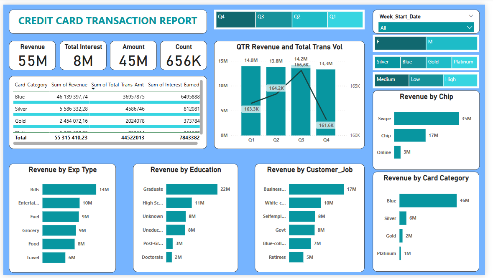

# 💳 Credit Card Data Analysis Dashboard – Power BI Project

## 📌 Overview

This project presents an interactive Power BI dashboard built from a synthetic dataset related to credit card usage and customer segmentation. It aims to provide business insights into customer behavior, spending patterns, and potential churn risk.

The project is structured around core data analysis themes used in finance and marketing: customer profiling, transaction activity, usage trends, and segmentation KPIs.

---

## 🎯 Key Objectives

- Visualize customer behavior across various dimensions (age, balance, credit limit, etc.)
- Identify high-value customers and potential churners
- Monitor KPIs related to payment behavior and customer retention
- Create a clean and responsive visual experience for business stakeholders

---

## 📁 Dataset

The dataset used is anonymized and contains synthetic records related to customer transactions and profiles, including:

- Customer ID, Age, Gender
- Credit Limit, Balance, Payment Ratio
- Spending scores and churn risk indicators

---

## 📊 Dashboard Highlights

- 📈 KPI cards: Total customers, average credit limit, balance, churn risk
- 📍 Dynamic filters for customer segmentation
- 📉 Histograms and trend analysis (age group, usage ratio, churn risk)
- 💬 Drill-through capabilities and interactive visuals

  

---

## 🛠 Tools Used

- Power BI Desktop
- DAX for calculated columns and measures
- Data cleaning and transformation via Power Query

---

## 👨‍💻 Author

**William Darryl Towa Kengne**  
📧 williamdarryltowa@gmail.com  
🔗 [LinkedIn](https://www.linkedin.com/in/william-darryl-towa-kengne)  
💻 [GitHub](https://github.com/williamdarryl22)

---

## 📘 Notes

This dashboard is for educational and portfolio purposes only.
