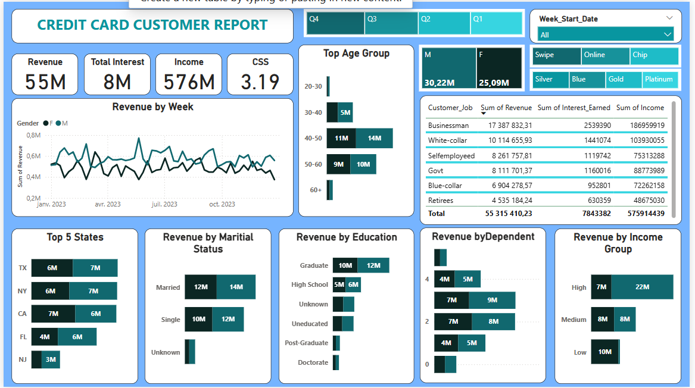

# 💳 Credit Card Customer & Transaction Dashboard – Power BI

## 📌 Overview

This project showcases a full **business intelligence dashboard** built with Power BI, designed to analyze credit card transaction data and customer behavior. It is structured in two interactive pages:  
1. **Transaction Report** – focused on revenue trends and card usage  
2. **Customer Report** – focused on customer segmentation and profile analysis

The objective is to enable business stakeholders to better understand usage patterns, segment customer types, and support decision-making through visual insights.

---

## 🧩 Pages & Key Insights

### 📄 Page 1 – Credit Card Transaction Report

- 📊 Revenue KPIs: Total Revenue (55M), Total Interest, Transaction Volume  
- 🔍 Segmentations by:
  - Card Category
  - Expense Type (Bills, Travel, Food...)
  - Payment Method (Chip, Swipe, Online)
  - Quarter-wise Revenue Trends (Q1–Q4)

### 👤 Page 2 – Customer Profile Report

- 🧠 Customer Segmentation by:
  - Age group
  - Gender
  - Education level
  - Marital status
  - Income group
  - Employment type (e.g. Self-employed, Retiree, Businessman)
- 📈 Weekly revenue trends by gender
- 🗺 Regional analysis: Top 5 US states by revenue

---

## 📊 Dashboard Features

- KPI Cards with custom DAX metrics  
- Slicers for real-time filtering by gender, card type, chip type, and time period  
- Interactive visuals and drill-downs across dimensions  
- CSS (Customer Satisfaction Score) as a calculated metric  
- Clean and responsive layout for business users

---

## 🧠 Tools & Technologies

- Power BI Desktop  
- Power Query for data transformation  
- DAX (Data Analysis Expressions) for metrics  
- Synthetic credit card customer dataset (anonymized)

---

## 📸 Dashboard Previews

  

  

---

## 👨‍💻 Author

**William Darryl Towa Kengne**  
📧 williamdarryltowa@gmail.com  
🔗 [LinkedIn](https://www.linkedin.com/in/william-darryl-towa-kengne)  
💻 [GitHub](https://github.com/williamdarryl22)

---

## 📘 Notes

This dashboard is for educational and professional portfolio purposes only. No real customer data was used.
